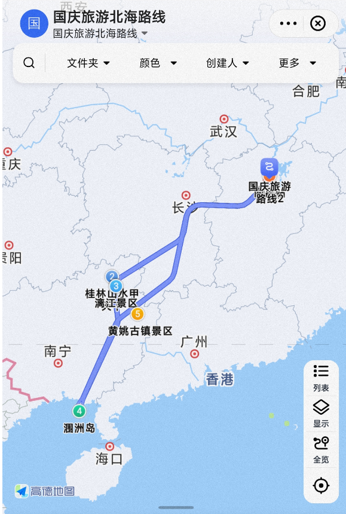
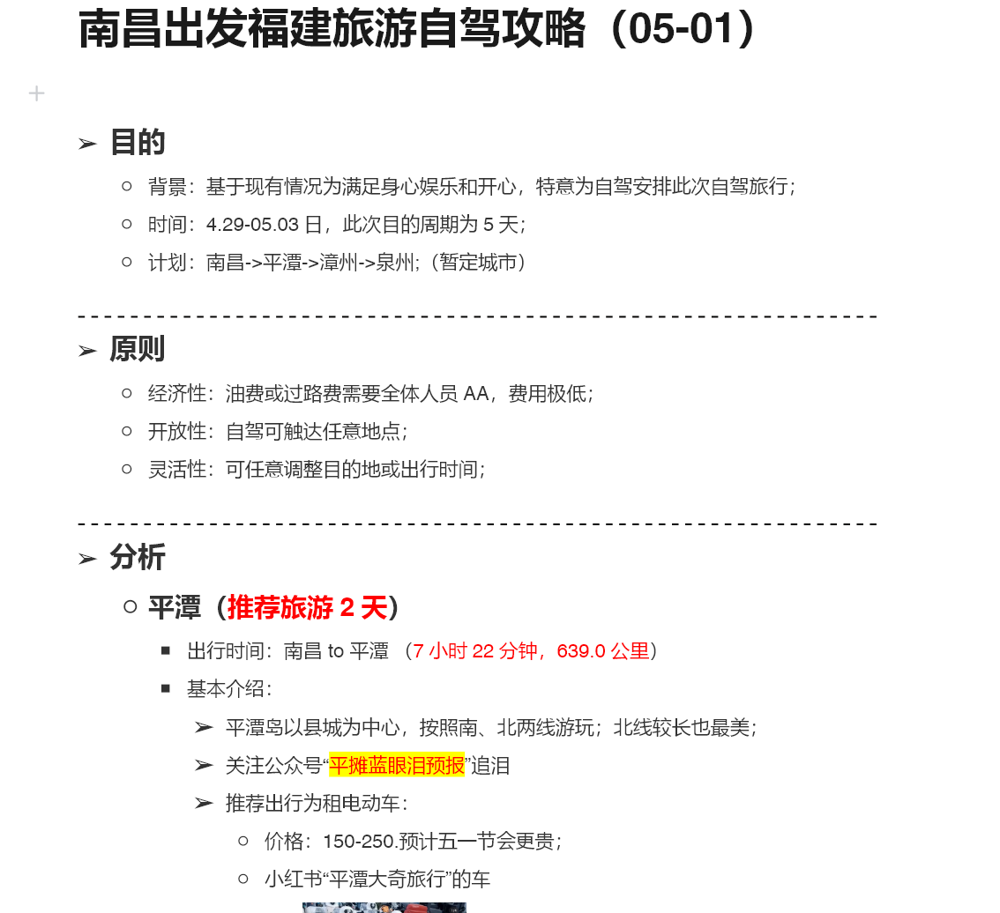
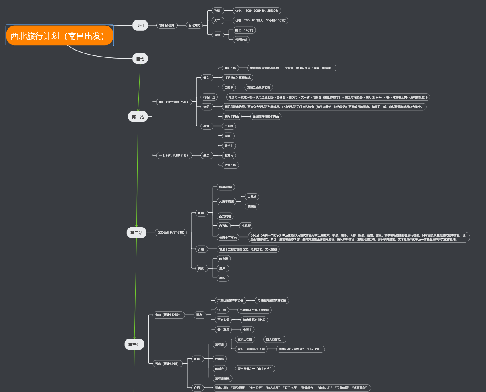

# 旅游攻略信息网站

#### 背景介绍

> 前提背景是自己喜欢旅游，特别是自驾游；<br/>
> + 2022年国庆节
    >

+ 高德地图路线规划版本

> + 

    >   + 另外还在某书"旅游搭子"找到了同行陌生人一起自驾游，2男3女，并且还成为了好朋友。

> + 2023年劳动节
    >

+ 尝试过去年的旅游搭子的快乐，今年是做大做强，从上次的5个人；

> + "旅游搭子"发展成为9人的队伍和2辆车，6个女生3个男生；
    >

+ 作为组织者：尽心尽责的写了第一版的文档攻略，极其像需求分析

> + 
> + 2023年国庆节
    >

+ 吸取了上次的文档版的经验（大家都不看，文档内容太过臃肿，什么都写了又什么都没写的感觉）

> + 这次做了思维导图版本
    >

+ 

> + 看起来不错，但是手机体验感极差

``` 
或许有人问，不是有很多旅游网站和攻略吗？
但是那些攻略都告诉你：去云南，先去昆明、在去大理、在去丽江.....
并没有详细告诉你要怎么玩，有什么景点，路线怎么走，但是在文档和思维导图就很臃肿。
基于以上经验和自己蠢蠢欲动的自驾游心情，想自己做一个带攻略+路线+组搭子的小程序
```

#### 介绍

功能要点

1.圈子（发动态、评论、收藏、点赞）<br/>
2.攻略（自行发布攻略资料->爬虫或照搬现有的）<br/>
3.景点（城市景点介绍）<br/>
4.路线+导航（提前设置点与点，直接导航目的地）<br/>
5.广场（旅游动态）<br/>
6.故事/音频（关于景点或地方的介绍以及文化录音）


> #### 功能模块
> - [ ] 圈子 - 待开发
> - [ ] 攻略 - 待开发
> - [ ] 组队 - 待开发
> - [ ] 景点 - 待开发
> - [ ] 路线/导航
    >

- [ ] 路线 - 开发中

> - [ ] 导航 - 开发中
> - [ ] 广场 - 待开发
> - [ ] 故事/音频 - 待开发
> - [ ] 用户 - 待开发

#### 开发计划

````
1.春节前完成路线/导航功能（因为我春节要自驾川西-朝圣之路）
````

#### 最新界面


#### 软件架构

脚手架 [maku后台管理系统](https://gitee.com/makunet/maku-boot)

```
API目录为后台代码
UI目录为前端代码
```

#### 安装教程

1. xxxx
2. xxxx
3. xxxx

#### 使用说明

1. xxxx
2. xxxx
3. xxxx

#### 参与贡献

1. Fork 本仓库
2. 新建 Feat_xxx 分支
3. 提交代码
4. 新建 Pull Request

#### 常见错误

1. 启动报错 ```` Caused by: java.lang.ClassNotFoundException: io.netty.handler.codec.dns.DatagramDnsResponseDecoder ````
   在maku-framework模块添加 netty-codec-dns 引用
